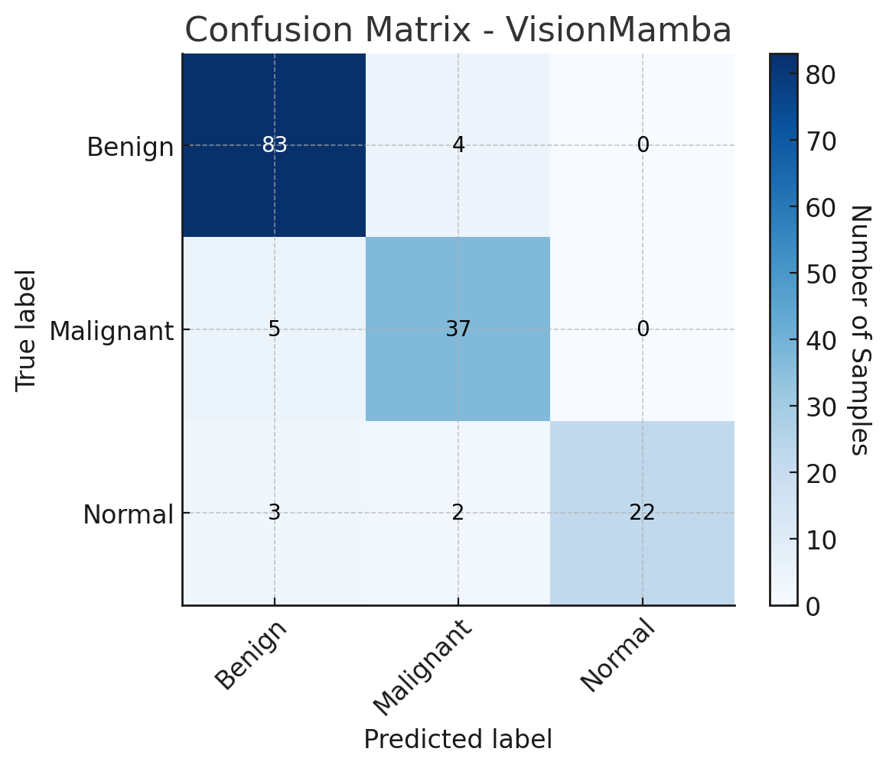
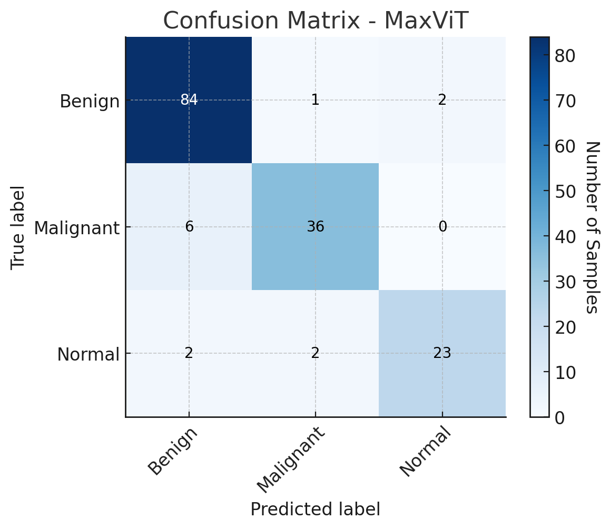
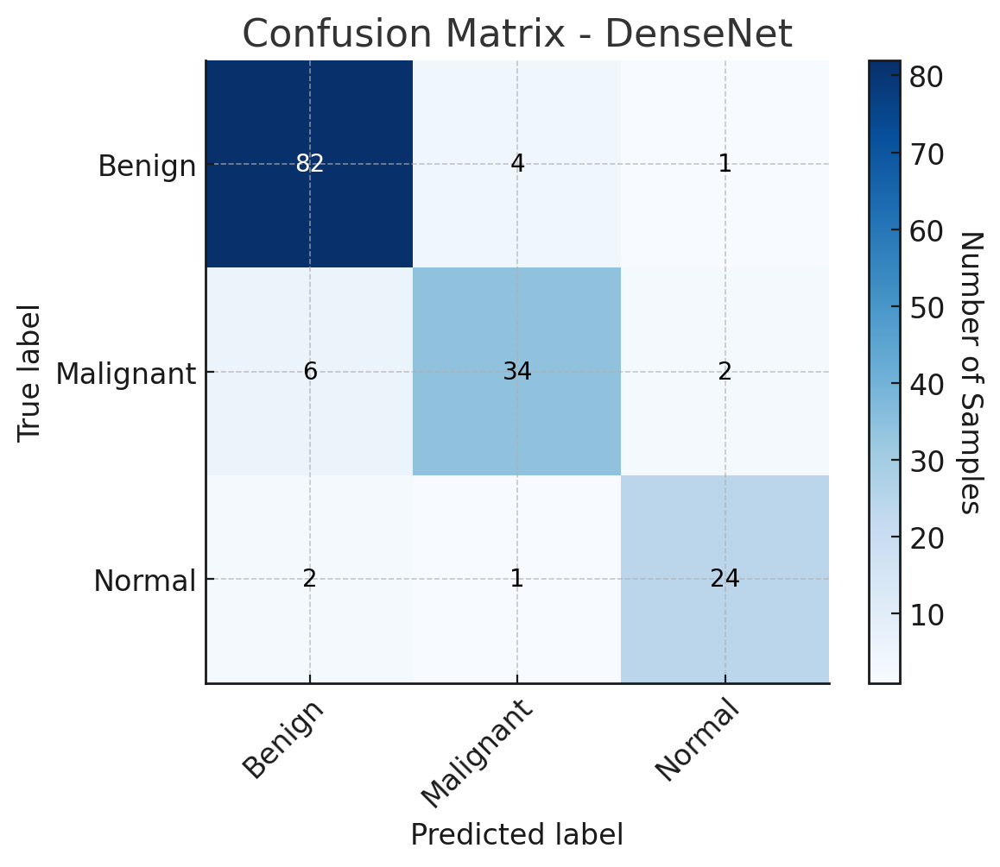
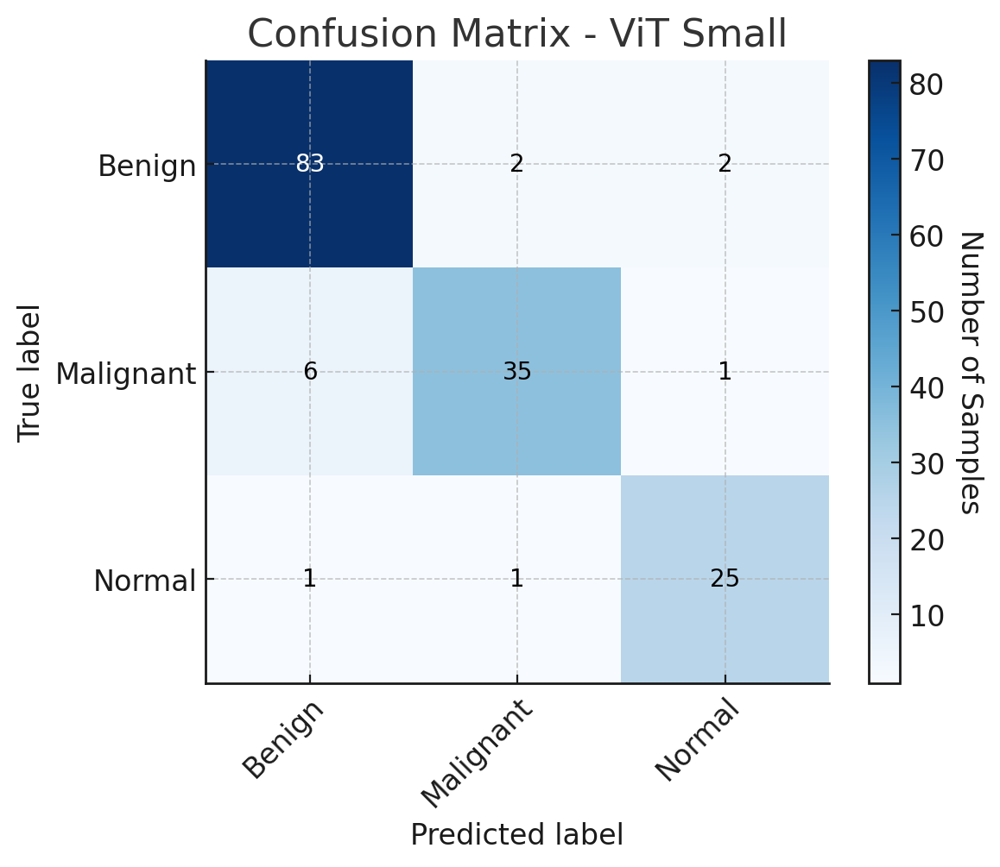
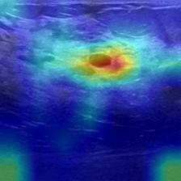
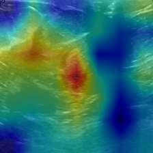
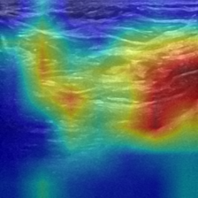

# UltraScanNet: A Mamba-Inspired Hybrid Backbone for Breast Ultrasound Classification

## 📜 Abstract
UltraScanNet combines:
- **Convolutional Stem** with learnable 2D positional embeddings  
- **Hybrid Stage** with MobileViT blocks, spatial gating, and convolutional residuals  
- **Progressively Global Stages** using a depth-aware mix of:
  1. **UltraScanUnit** — a state-space module with selective scan, gated convolutional residuals, and low-rank projections  
  2. **ConvAttnMixers** — spatial-channel mixing modules  
  3. **Multi-Head Self-Attention Blocks** — for global reasoning  

A detailed ablation study evaluates the individual and combined contributions of each component.

## 📊 Performance on BUSI Dataset
UltraScanNet achieves:
- **Top-1 Accuracy:** **91.67%**
- **Precision:** **0.9072**
- **Recall:** **0.9174**
- **F1-Score:** **0.9096**

### 📈 Comparison with SOTA Models
| Model              | Top-1 Accuracy (%) |
|--------------------|--------------------|
| **UltraScanNet**   | **91.67**          |
| ViT-Small          | 91.67              |
| MaxViT-Tiny        | 91.67              |
| MambaVision        | 91.02              |
| Swin-Tiny          | 90.38              |
| ConvNeXt-Tiny      | 89.74              |
| ResNet-50          | 85.90              |

UltraScanNet ranks among the **top-performing models**, providing competitive accuracy with fewer parameters compared to several transformer-based backbones.

## 🧪 Key Features
- **Learnable 2D Positional Embeddings** in the early convolutional stem  
- **Hybrid Local-Global Encoding** for efficient feature extraction  
- **Depth-Aware Operation Scheduling** (UltraScanUnit → ConvAttnMixer → MHSA)  
- **Extensive Benchmarking** against CNN, Transformer, and Mamba-based architectures  
- **Per-Class & Global Performance Analysis**


## 📊 Confusion Matrices

Below are the confusion matrices for 5 evaluated models on the BUSI dataset:

| UltraScanNet | MambaVision Baseline | 
|--------------|----------------------|
|  |  | 

| MaxViT-Tiny | DenseNet-121 | ViT-Small |
|-------------|--------------| -----------|
|  |  |  |


## 🔍 Grad-CAM Visualizations

Grad-CAM helps visualize which regions of the breast ultrasound images contributed most to the model’s decision.  
Below are some examples from **UltraScanNet** for each class:

| Benign | Malignant | Normal |
|--------|-----------|--------|
|  |  |  |


### 📜 Reproducing Paper Results
To reproduce **all the reported values in the paper** (accuracy, precision, recall, F1-score, per-class metrics, curves and confusion matrices), run:

```bash
python3 ultrascannet/launch_validation.py
```

### 📥 Pretrained Weights & Configurations

We provide **pretrained weights** and the **configuration files** so that you can reproduce our results.

- **OneDrive Link:** [Download Here](https://uptro29158-my.sharepoint.com/:f:/g/personal/alexandra_laicu-hausberger_student_upt_ro/Em88eUDjtxBKmFMdmV75XBYB-AmQabzwnSjD-IzuwCstqA?e=5JkkdL)